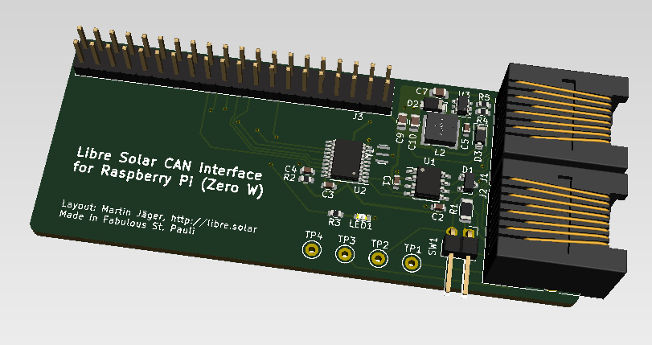

# Libre Solar CAN interface for Raspberry Pi (Zero W)

**Caution:** Developed using nightly build of KiCAD because of several nice features. Unfortunately, the files are not compatible with the current stable version, but a new compatible stable release (v5) of KiCad is expected soon.

## CAN to Wifi Gateway

This interface PCB allows to read data from the CAN bus connecting the Libre Solar components. So the Raspberry Pi can be used as a gateway to IoT applications and energy monitoring (e.g. using Open Energy Monitor).

The pin header is compatible with all Raspberry Pi models, but the size is especially suited for the Raspberry Pi Zero W.



## Features:
- CAN interface via SPI using MCP2515 controller and TJA1042T/3 transceiver
- Power supply of Raspberry Pi via bus connector (RJ45)
- CAN transceiver standby connected to GPIO 24 (low power consumption mode possible)
- LED on GPIO 22 for custom status information

## Installation

Make sure to install the latest Raspbian onto your Raspberry Pi and connecto to it via SSH.

In order to activate the MCP2515 CAN controller, add the following lines to the file */boot/config.txt*:

```
# MCP 2515 CAN controller
dtparam=spi=on
dtoverlay=mcp2515-can0,oscillator=8000000,interrupt=25
```

Other guides for CAN on Raspberry Pi still suggest to add a line *dtoverlay=spi-bcm2835-overlay*. This is not true anymore, as Raspbian loads the BCM2835 SPI driver automatically.

Bring the interface up with the following command (change bitrate according to your needs):

```
sudo ip link set can0 up type can bitrate 250000
```

Now you should be able to send some test messages with *cansend* or watch messages on the bus:

```
candump can0
```

If something went wrong, try the following command to get some information about the CAN interface:

```
ip -s -d link show can0
```
